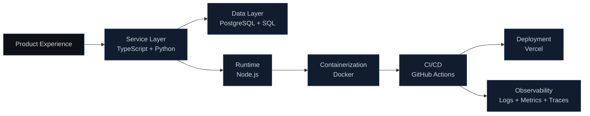

  

<h1 align="center">Luseefor</h1>

<strong>Founder Engineer</strong>

Designing and shipping AI-native products with production-grade reliability.

  
  
  
  
  

## About
I build product systems that move fast without breaking at scale. My work combines founder-level ownership, pragmatic architecture, and developer-first execution.

Focused on durable systems, fast iteration loops, and measurable product impact.

| Focus | Direction |
| --- | --- |
| Product | `AI-native features that solve real workflow problems` |
| Platform | `Scalable backend foundations with reliable delivery` |
| Developer Experience | `Tooling and interfaces that reduce friction for teams` |
| Base | `Remote` |

## Core Experience
| Capability | What It Delivers |
| --- | --- |
| `0->1 Delivery` | MVP to production with clean ownership and clear milestones |
| `Platform Strategy` | Faster releases, stronger reliability, and safer operations |
| `System Architecture` | Maintainable services that scale with product demand |
| `Engineering Leadership` | High-trust execution across product and infrastructure workstreams |

## Selected Stack (System View)

| Layer | Stack |
| --- | --- |
| Core Languages | `TypeScript`, `Python`, `SQL` |
| Runtime and Infra | `Node.js`, `Docker`, `PostgreSQL` |
| Delivery and Operations | `GitHub Actions`, `Vercel`, `Observability workflows` |
| Engineering Priorities | `Clarity`, `Fast iteration`, `Reliability`, `Maintainability` |

## GitHub Performance

  

<table width="100%" cellspacing="0" cellpadding="0">
  <tr>
    <td width="50%">
      
    </td>
    <td width="50%">
      
    </td>
  </tr>
</table>

These cards refresh daily at midnight Nepal Time.

## Contribution Snake
<picture>
  <source media="(prefers-color-scheme: dark)" srcset="https://raw.githubusercontent.com/Luseefor/Luseefor/output/github-snake-dark.svg" />
  <source media="(prefers-color-scheme: light)" srcset="https://raw.githubusercontent.com/Luseefor/Luseefor/output/github-snake.svg" />
  
</picture>
