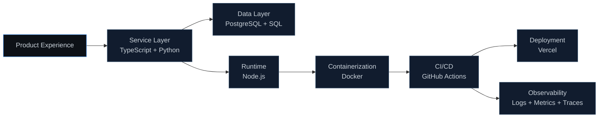

  

<h1 align="center">Luseefor</h1>

<strong>Software Engineer</strong>

AI systems, interactive tools, and native macOS apps.

Dual B.S. Computer Engineering and Mathematics · University of Southern Mississippi

Open to internships and early-career software engineering roles.

  
  
  
  
  

## About
Hi, I'm Rijan. I'm a Computer Engineering and Mathematics student who writes software. Lately that's meant turning abstract math into explorable 2D/3D visualizations ([vinculum](https://github.com/Luseefor/vinculum)), building a cross-platform component system ([Synthex UI](https://github.com/Luseefor/synthex-ui)), and making macOS apps that stay out of your way ([LumaWall](https://github.com/Luseefor/LumaWall), [Automater](https://github.com/Luseefor/Automater)).

I care more about shipping something useful than chasing trends.

## Now
- Finishing my dual B.S. in Computer Engineering and Mathematics at the University of Southern Mississippi.
- Making [vinculum](https://vinculum.rijan.sh) easier for students to use for math and physics.
- Looking for an internship where I can work on real products with real users.

## Selected Work

| Project | What it is | Try it |
| --- | --- | --- |
| **[vinculum](https://github.com/Luseefor/vinculum)** | Interactive 2D/3D math visualization for implicit surfaces, planes, and parametric curves | [vinculum.rijan.sh](https://vinculum.rijan.sh) |
| **[Synthex UI](https://github.com/Luseefor/synthex-ui)** | Cross-platform component library, theme system, and workbench engine | [synthex-ui.rijan.sh](https://synthex-ui.rijan.sh) |
| **[LumaWall](https://github.com/Luseefor/LumaWall)** | Live video wallpapers for macOS, from files already on your disk | [repo](https://github.com/Luseefor/LumaWall) |
| **[alove](https://github.com/Luseefor/alove)** | Web LaTeX workspace: Next.js editor, Docker TeX Live compile worker | [repo](https://github.com/Luseefor/alove) |
| **[Automater](https://github.com/Luseefor/Automater)** | macOS desktop automation for clicking, macros, and recording | [repo](https://github.com/Luseefor/Automater) |
| **[portfolio](https://github.com/Luseefor/portfolio)** | Personal site, including a WebGL dungeon demo | [rijan.sh](https://www.rijan.sh) |

## Core Experience
| Capability | What It Delivers |
| --- | --- |
| `0->1 Delivery` | MVP to production with clean ownership and clear milestones |
| `Platform Strategy` | Faster releases, stronger reliability, and safer operations |
| `System Architecture` | Maintainable services that scale with product demand |
| `Engineering Leadership` | High-trust execution across product and infrastructure workstreams |

## Focus
| Area | Direction |
| --- | --- |
| Product | `AI-native features that solve real workflow problems` |
| Platform | `Scalable backend foundations with reliable delivery` |
| Developer Experience | `Tooling and interfaces that reduce friction for teams` |
| Base | `Remote` |

## Selected Stack (System View)

```mermaid
flowchart LR
    Product["Product Experience"] --> Services["Service Layer<br/>TypeScript + Python"]
    Services --> Data["Data Layer<br/>PostgreSQL + SQL"]
    Services --> Runtime["Runtime<br/>Node.js"]
    Runtime --> Container["Containerization<br/>Docker"]
    Container --> CI["CI/CD<br/>GitHub Actions"]
    CI --> Deploy["Deployment<br/>Vercel"]
    CI --> Observe["Observability<br/>Logs + Metrics + Traces"]

    classDef node fill:#111C2E,stroke:#2F4A68,color:#C9D1D9;
    classDef root fill:#0D1117,stroke:#58A6FF,color:#C9D1D9;
    class Product root;
    class Services,Data,Runtime,Container,CI,Deploy,Observe node;
```

| Layer | Stack |
| --- | --- |
| Core Languages | `TypeScript`, `Python`, `SQL` |
| Runtime and Infra | `Node.js`, `Docker`, `PostgreSQL` |
| Delivery and Operations | `GitHub Actions`, `Vercel`, `Observability workflows` |
| Engineering Priorities | `Clarity`, `Fast iteration`, `Reliability`, `Maintainability` |

## GitHub Performance

  

<table width="100%" cellspacing="0" cellpadding="0">
  <tr>
    <td width="50%">
      
    </td>
    <td width="50%">
      
    </td>
  </tr>
</table>

## Contribution Snake
<picture>
  <source media="(prefers-color-scheme: dark)" srcset="https://raw.githubusercontent.com/Luseefor/Luseefor/output/github-snake-dark.svg" />
  <source media="(prefers-color-scheme: light)" srcset="https://raw.githubusercontent.com/Luseefor/Luseefor/output/github-snake.svg" />
  
</picture>

## Let's talk
If you're working on something interesting — or just want to chat about math visualization, macOS dev, or AI tooling — reach out at [contact@rijan.sh](mailto:contact@rijan.sh) or on [LinkedIn](https://www.linkedin.com/in/rijan-ghimire-37ba4a2b0/).

  
  &nbsp;&nbsp;
  

