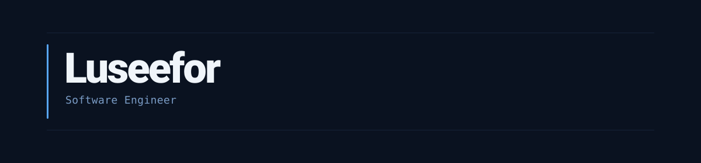

  

<h1 align="center">Rijan Ghimire</h1>

<strong>Software Engineer</strong>

AI systems, interactive tools, and native macOS apps.

Dual B.S. Computer Engineering and Mathematics · University of Southern Mississippi

  
  
  
  
  

Open to internships and early-career software engineering roles.

## About

I build tools people can actually use: math visualization in the browser, a component system with a live docs site, and native macOS apps. TypeScript, Swift, and Python.

## Selected work

| Project | What it is | Try it |
| --- | --- | --- |
| **[vinculum](https://github.com/Luseefor/vinculum)** | Interactive 2D/3D math visualization for implicit surfaces, planes, and parametric curves | [vinculum.rijan.sh](https://vinculum.rijan.sh) |
| **[Synthex UI](https://github.com/Luseefor/synthex-ui)** | Cross-platform component library, theme system, and workbench engine | [synthex-ui.rijan.sh](https://synthex-ui.rijan.sh) |
| **[LumaWall](https://github.com/Luseefor/LumaWall)** | Live video wallpapers for macOS, from files already on your disk | [repo](https://github.com/Luseefor/LumaWall) |
| **[alove](https://github.com/Luseefor/alove)** | Web LaTeX workspace: Next.js editor, Docker TeX Live compile worker | [repo](https://github.com/Luseefor/alove) |
| **[Automater](https://github.com/Luseefor/Automater)** | macOS desktop automation for clicking, macros, and recording | [repo](https://github.com/Luseefor/Automater) |
| **[portfolio](https://github.com/Luseefor/portfolio)** | Personal site, including a WebGL dungeon demo | [rijan.sh](https://www.rijan.sh) |
